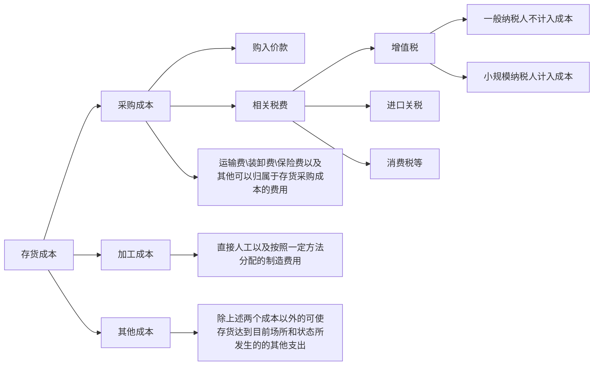

# 存货

## 一、主要内容

1. 外购存货的初始计量
2. 委托加工物资实际成本的构成
3. ***存货期末计量***
4. ***投资者投入存货的计量***
5. 通过提供劳务取得存货的初始计量

***注意：存货的增值税税率发生了变化，看清题目所给增值税税率***

## 二、存货的确认和初始计量

### （一）确定是否为存货的唯一标准：用于出售

> 例1：汽车制造厂的汽车：
>
> ```flow
> st=>start: 企业制造企业
> e=>end: 判读为存货
> op=>operation: 是否以出售为目的持有
> sub1=>subroutine: 固定资产
> cond=>condition: yes or no?
> st->op->cond
> cond(yes)->e
> cond(no)->sub1(right)
> ```
>
> 
>
> 例2：企业购买的土地： 
>
> 
>
> ```flow
> st=>start: 企业购买土地
> e=>end: 判读为存货
> op=>operation: 是否以出售为目的持有
> cond=>condition: yes or no?
> sub1=>subroutine: 无形资产
> st->op->cond
> cond(yes)->e
> cond(no)->sub1(right)
> 
> ```

###  （二）、外购存货的初始成本构成




**注意：**

**1.运输途中的合理损耗要计入存货成本**

> 例题1：甲公司为增值税一般纳税人，本期购入一批商品，进货价格为80万元，增值税进项税额为10.4万元，所购商品验收后发现商品短缺30%，其中合理损失5%，另外25%的短缺尚待查明原因，甲公司该批存货的实际成本为（　　）万元。
>
> A.67.8
>
> B.56
>
> C.80
>
> D.60
>
> ***解析：*** 该批存货的总成本=价款=80万
>
> **其中，发生商品短缺，合理损失5%，另外25%为不合理损失，合理损失计入存货成本，否则不计入存货成本，即要将25%的损失从成本中扣减。**
>
> 因此实际成本=80万*75%=60万 
>
> 例题2 :甲公司系增值税一般纳税人，2018年3月2日购买W商品1 000千克，运输途中合理损耗50千克，实际入库950千克。甲公司取得的增值税专用发票上注明的价款为95 000元，增值税税额为16 150元。不考虑其他因素，甲公司入库W商品的单位成本为（　　）元/千克。（2018年）
>
> A.100
>
> B.95
>
> C.117
>
> D.111.15
>
> **解析：** 该批存货总成本=价款-95000元
>
> **其中，运输途中合理损耗50千克，应计入存货成本，即不应从存货总成本剔除，但是因为实际入库950千克**
>
> 因此实际单位成本=95000/950=100元/千克

**\**2.商品流通企业在采购商品过程中发生的运输费、装卸费、保险费以及其他可归属于存货采购成本的费用等进货费用，应计入所购商品成本，也可以先进行归集，期末再根据所购商品的存销情况进行分摊。商品流通企业采购商品的进货费用金额较小的，可以在发生时直接计入当期损益（销售费用）**

对于采购过程中发生的物资毁损、短缺等，除合理的途耗应当作为存货的其他可归属于存货采购成本的费用计入采购成本外，应区别不同情况进行会计处理：

（1）应从供货单位、外部运输机构等收回的物资短缺或其他赔款，冲减所购物资的采购成本。

（2）因遭受意外灾害发生的损失和尚待查明原因的途中损耗，**不得增加**物资的采购成本，暂作为待处理财产损溢进行核算，查明原因后再作处理。

***注意：待处理财产损益科目期末无余额***

### （三）通过进一步加工取得的存货


## 三、存货的期末计量


### (一)、原则

资产负债表日，存货应当按照成本与**可变现净值**孰低计量。存货成本高于其可变现净值的，应当计提存货跌价准备，计入当期损益（**资产减值损失**）。

可变现净值，是指在日常活动中，存货的估计售价减去至完工时估计将要发生的成本、估计的销售费用以及相关税费后的金额。

存货成本，是指期末存货的实际成本。

【提示】企业预计的销售存货现金流量，并不完全等于存货的可变现净值。

### (二)、方法  

#### (1). 减值迹象的判断

> +  存货存在下列情况之一的，表明存货的可变现净值低于成本，应当计提存货跌价准备 : 
>   + 该存货的市场价格持续下跌，并且在可预见的未来无回升的希望;
>   + 企业使用该 项原材料生产的产品戚本大于产品的销售价格;
>   + 企业因产品更新换代，原有库存原材料已不适应新产品的需要，而该原材料的市场价格又低于其账面成本
>   +   因企业所提供的商品或劳 务过 时或消费者偏好改变而使市场的需求发生变化，导致市场价格逐渐下跌;
>   + 其他足以证明该项存货实质上已经发生减值的情形。
> +  存货存在下列情形之一的，通常表明存货的可变现净值为零，应当全额计提存货跌价准备:
>    + 已霉烂变质的存货;
>    + 已过期且无转让价值的存货;
>    + 生产中已不再需要，并且已无使用价值和转让价值的存货;
>    + 其他足以证明已无使用价值和转让价值的存货 。

#### (2).可变现净值的确定

> 1.企业确定存货的可变现净值时应考虑的因素
>
> 企业确定存货的可变现净值，应当以取得的确凿证据为基础，并且考虑持有存货的目的、资产负债表日后事项的影响等因素。
>
> （1）存货可变现净值的确凿证据
>
> 存货可变现净值的确凿证据，是指对确定存货的可变现净值有直接影响的客观证明，如产成品或商品的市场销售价格、与企业成产品或商品相同或类似商品的市场销售价格、销售方提供的有关资料和生产成本资料等。
>
> （2）持有存货的目的
>
> 直接出售的存货与需要经过进一步加工出售的存货，两者可变现净值的确定是不同的。
>
> （3）资产负债表日后事项的影响
>
> 在确定资产负债表日存货的可变现净值时，应当考虑：一是以资产负债表日取得最可靠的证据估计的售价为基础并考虑持有存货的目的；二是资产负债表日后发生的事项为资产负债表日存在状况提供进一步证据，以表明资产负债表日存在的存货价值发生变动的事项。


**注意：如果企业销售合同所规定的标的物还没有生产出来，但持有专门用于生产该标的物的材料，则其可变现净值也应以合同价格作为计量基础。**

> 例题1：2×16年12月31日，甲公司库存原材料——钢材的账面价值为600 000元，可用于生产1台C型机器，相对应的市场销售价格为550 000元，假设不发生其他购买费用。由于钢材的市场销售价格下降，用钢材作为原材料生产的C型机器的市场销售价格由1 500 000元下降为1 350 000元，但其生产成本仍为 1 400 000元，即将该批钢材加工成C型机器尚需投入800 000元，估计销售费用及税金为50 000元。假定不考虑增值税。计算材料账面价值？
>
> **解析：** 
>
> > 1. 钢材用于生产1台C型机器，***要计算材料的可变现净值，则需要计算产成品是否发生减值***
> >
> >    C型机器的可变现净值=135万-5万=130万
> >
> >    C型机器的成本=60万+80万=140万元
> >
> >    可变现净值<成本——>产成品C型机器发生了减值，进一步计算原材料钢材的可变现净值
> >
> > 2. 钢材的可变现净值=135万-80万-5万=50万
> >
> > 3. ***钢材的成本为60万，库存的期末计量按可变现净值与成本孰低原则计量可知：材料的账面价值为50万***
>
> 例题2：2×15年9月10日，甲公司与丁公司签订了一份不可撤销的销售合同，双方约定，2×16年2月15日，甲公司应按180 000元/台的价格向丁公司提供C型机器10台。2×15年12月31日，甲公司C型机器的账面价值为1 920 000元，数量为12台，单位成本为160 000元/台。2×15年12月31日，C型机器的市场销售价格为200 000元/台。假定不考虑增值税。如何确定估计售价？
>
> 
>
> 
>
> **解析：**
>
> > 1. 本题涉及到存在合同的情况，则按照前述理论，合同内数量的预计售价按合同价，即10台C型机器预计售价为合同价18万元
> > 2. 超出合同数量的2台C型机器预计售价为市场价格20万

#### (3).存货跌价准备的计提和转回

##### a.存货跌价准备的计提

资产负债表日，存货的成本高于其可变现净值的，企业应当计提存货跌价准备。

借：资产减值损失

　贷：存货跌价准备

单项、类别、总体三种。

***特别注意：存货跌价准备的贷方余额=成本—可变现净值***

***实际上每次计提的金额由贷方余额与期初借贷方余额比较得出****

> 例题1：甲公司按照单项存货计提存货跌价准备。2×16年12月31日，A、B两项存货的成本分别为300 000元、210 000元，可变现净值分别为280 000元、250 000元，假设“存货跌价准备”科目余额为0。计算存货跌价准备计提数？
>
> **解析：**
>
> > 存货跌价准备应该按照单项进行计提：
> >
> > 1. A存货可变现净值=28万元，其成本为30万元，根据存货期末计量的原则“可变现净值与成本孰低”，可得A存货已经发生减值2万元。
> >
> > 2. B存货可变现净值为25万元，其成本为21万元，根据存货期末计量原则“可变现净值与成本孰低”，可得其账面价值仍为成本21万元，不发生减值。
> >
> > 3. 因存货跌价准备科目余额为0，则应计提A存货跌价准备2万元：
> >
> >    借：资产减值损失—A  20000
> >
> >    ​      贷：存货跌价准备—A 20000
>
> 例题2：丙公司2×15年末，A存货的账面成本为100 000元，由于本年以来A存货的市场价格持续下跌，根据资产负债表日状况确定的A存货的可变现净值为95 000元，“存货跌价准备”期初余额为零，应计提的存货跌价准备为5000元（100 000-95 000）。相关账务处理如下：
>
> >借：资产减值损失——A存货　　　　　　　　　　　5 000
> >
> >​     贷：存货跌价准备——A存货　　　　　　　　　　　5 000

##### b.存货跌价准备的转回

企业应在每一资产负债表日，比较存货成本与可变现净值，计算出应计提的存货跌价准备，再与已提数进行比较，若应提数大于已提数，应予补提。企业计提的存货跌价准备，应计入当期损益（资产减值损失）。

***当以前减记存货价值的影响因素已经消失，减记的金额应当予以恢复，并在原已计提的存货跌价准备金额内转回，转回的金额计入当期损益（资产减值损失）***

> 1. 其他的原因***。
> 2. 转回的金额以计提的金额为限，即不能出现期末存货跌价准备借方余额

> 例题3（沿用例题2），假设2×16年末，丙公司存货的种类和数量、账面成本和已计提的存货跌价准备均未发生变化，但是2×16年以来A存货市场价格持续上升，市场前景明显好转，至2×16年末根据当时状态确定的A存货的可变现净值为110 000元。
>
> ***解析：***
>
> 1. 存货可变现净值=11万>存货成本10万，因此存货跌价准备期末贷方余额应该为0
>
> 2. 根据例题2存货跌价准备已经有5000元贷方余额，因此要将贷方余额5000元转到借方，使其期末贷方余额为0
>
> 3. 借：存货跌价准备  5000
>
>       贷：资产减值损失  5000  
>
> ***需要注意的是，导致存货跌价准备转回的是以前减记存货价值的影响因素的消失，而不是在当期造成存货可变现净值高于其成本的其他影响因素。如果本期导致存货可变现净值高于其成本的影响因素不是以前减记该存货价值的影响因素，则不允许将该存货跌价准备转回。***

#### c.存货跌价准备的结转

1. 企业计提了存货跌价准备，如果其中有部分存货已经销售，则企业在结转销售成本时，应同时结转对其已计提的存货跌价准备。

   已售存货结转成本的会计分录为：

   借记“主营业务成本或（其他业务成本）”、“存货跌价准备”等，

   贷记“库存商品”等。

   库存商品在实现销售时，需要关注该库存商品是否计提了存货跌价准备。

2. 对于因债务重组、非货币性资产交换转出的存货，应同时结转已计提的存货跌价准备，但不冲减当期的资产减值损失（关键点），按债务重组和非货币性资产交换的原则进行会计处理。
3. 按存货类别计提存货跌价准备的，也应按比例结转相应的存货跌价准备。
4. 企业将已经计提存货跌价准备的存货用于在建工程，应当同时结转相应的存货跌价准备。

> 例题4，2×15年，甲公司库存A机器5台，每台成本为5 000元，已经计提的存货跌价准备合计为6 000元。2×16年，甲公司将库存的5台机器全部以每台6 000元的价格售出，适用的增值税税率为16%，货款未收到。写出相关账务处理
>
> **解析：**
>
> 1. 确定主营业务收入：
>
>    借：银行存款       34800
>
>    ​      贷：主营业务收入 ———A机器    30000（6000*5）
>
>    ​              应交税费——应交增值税（销项税额） 4800（30000*16%）
>
> 2. 结转主营业务成本：
>
>    借：主营业务成本——A机器   19000（25000-6000）
>
>    ​        存货跌价准备——A机器    6000
>
>    ​       贷：库存商品——A机器      25000（5*5000）

**特别注意：存货跌价准备的转回：因前期导致存货跌价的因素消失或者发生变化，存货此时还在企业，**

**而存货跌价准备结转是因为存货已经销售或其他原因不再本企业了**

## 四、课后经典习题

1. 甲公司以人 民 币作为记账本位币 ， 对期 末存 货 按 成本与可.变 现净值孰低计价 。 2 01 5 年 5 月 1 日 ,甲 公 司 进 口 一 批商品 ， 价 款 为 2 0 0 万美 元 ， 当日即 期汇 率 为 1美元 = 6.1 人民币 元。 20 1 5 年 1 2 月 3 1 日 ， 甲公司 该 批商品中仍有 5 0 % 尚 未 出 售， 可变 现 净 值为 9 0 万美元，当 日即期汇 率 为 1 美元 = 6. 2 人民币元 。 不 考虑其 他因 素，20 1 5 年 1 2 月 3 1 日 ，该 批商品期 末 计价对甲 公 司利润 总额 的 影 响 金额为（    ）人民币万 元。
   
    A. 减 少 1 04&emsp;&emsp;&emsp;&emsp;&emsp;&emsp;&emsp;&emsp; B . 增 力 1 0 4<br/>
C.增 力 52&emsp;&emsp;&emsp;&emsp;&emsp;&emsp;&emsp;&emsp;&emsp;D. 减 少 52 
   
   > 解析：
   >
   > 1. 期末库存商品还有50%，因此其成本为200*6.1/2=610万元
   >
   > 2. 期末可变现净值=90*6.2=558万元
   >
   > 3. 可变现净值<成本，应计提存货跌价准备为610-558=52万元
   >
   >    借：资产减值损失    52
   >
   >    ​    贷：存货跌价准备   52
   >
>    答案：**D** 

2. 20 1 5 年 1 2 月 1 日 ， 甲公司与乙公司 签 订了 一项 不可撤销的销售合同 ，约定甲公司于 2016 年 1 月 12 日以每吨 2 万元的价格(不合增值税)向乙公司销售 K 产品200 吨。 20 1 5 年 1 2 月 3 1 日 ， 甲公司库存该产品 300 吨 ，单位成本 为1. 8 万元 ，单位市场销售价格为1. 5 万元(不含增值税)。甲公司预计销售上述 300 吨库存产品将发生销售费用和其他相关税费 25 万元。不考虑其他因素， 20 1 5 年 1 2 月 31 日 ， 上 述 300 吨库存产品的账面价值为（    ）万元。

   A. 425&emsp;&emsp;&emsp; &emsp;&emsp;&emsp;&emsp;&emsp;&emsp;B. 501. 67<br/>
   C. 540&emsp;&emsp;&emsp;&emsp;&emsp;&emsp;&emsp;&emsp;&emsp; D. 550

> 解析：
>
> 1. 有合同的，在合同数量范围内以合同价格为预计售价，因此200吨产品的可变现净值=2*200-25\*2/3=383.4万元，该部分的成本=200\*1.8=360万元，可变现净值>成本，因此账面价值为成本360万元。
> 2. 超过合同数量范围的以市场价格为预计售价，因此100吨产品的可变现净值=100*1.5-25/3=141.67万元，该部分成本=100\*1.8=180，可变现净值小于成本，该部分账面价值为141.67万元
> 3. 这300吨产品的账面价值=360+141.67=501.67万元，答案选B
>
> 注意：
>
> + 有合同与没有合同的分开计算
> + 合同范围内的和超过合同范围的分开计算


